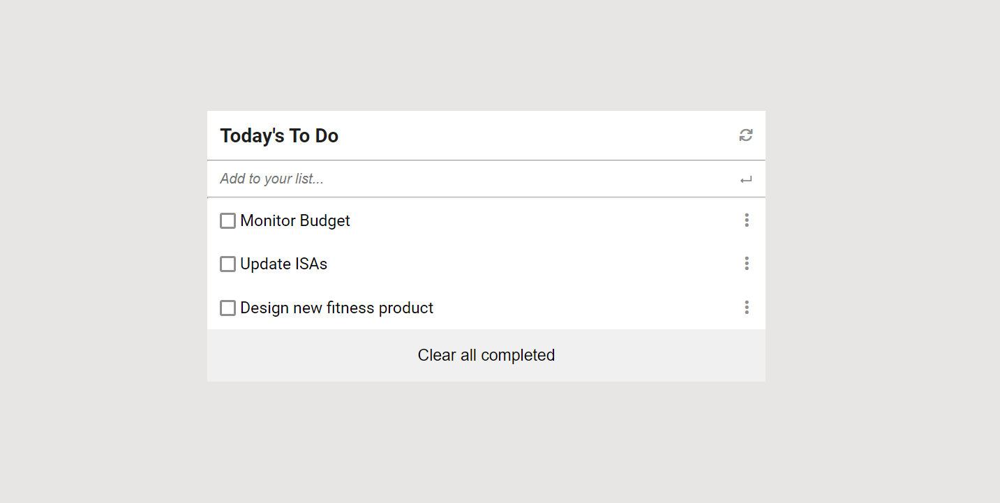

# Todo List

> This project is a simple To-Do List built to keep track of tasks that need to be done.

## Built With

- HTML
- CSS
- Javascript
- Node.js (npm) & Webpack.
- Jest(for testing).

## Live Demo (if available)

[**See Project 🚀**](https://davezag.github.io/To-do-list/)

## Screenshot



## Getting Started

To get a local copy up and running follow these simple example steps.

### Prerequisites

To understand the project you must have a basic knowledge of HTML, CSS and Javascript.

### Setup

To run this project one must have Visual Studio (VS) Code installed and running.

### Usage

Clone and access the repository using the following commands on Git Bash:

```
 cd PATH
 git clone https://github.com/DaveZag/To-do-list.git
 cd To-do-list
index.html
```

Open the directory in visual studio code by typing the following command in Git Bash:

```
code .
```

Then using the live server of VS Code you can view the page.

### Testing
This project contains some function tests. To run them, you first need to install [node.js](https://nodejs.org/en/download/). Then open the copy of this project that you cloned either in vscode or command prompt.<br>
Finall run the following command in the CLI(Terminal).
```
npm test
```

## 👤Authors
👤 **Dave Zagabe**
- GitHub: [@Dave Zag](https://github.com/DaveZag)
- Twitter: [@Dave Zagabe](https://twitter.com/davezagabe2)
- LinkedIn: [@Dave Zagabe](https://www.linkedin.com/in/dave-zagabe)

👤 **Tashobya Israel**

- GitHub: [@Tash Israel](https://github.com/tashisrael)
- Twitter: [@Tash Israel](https://twitter.com/tashisrael)
- Linkedin: [@Tashoya-Israel](https://www.linkedin.com/in/tashobya-israel-6a66b0181/l)

## 🤝 Contributing

Contributions, issues, and feature requests are welcome!

Feel free to check the [issues page](../../issues/).

## Show your support

Give a ⭐️ if you like this project!

## Acknowledgments

- The pics used are from Flaticon.

## 📝 License

This project is [MIT](./LICENSE) licensed.
